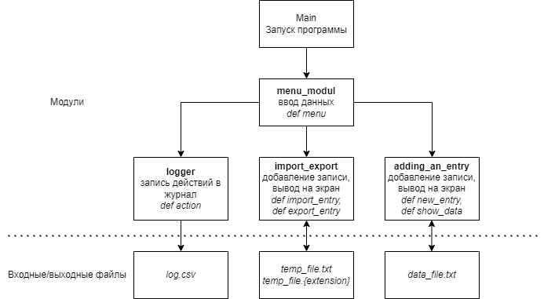

# Телефонный справочник

## Описание задачи
Создать телефонный справочник с возможностью импорта и экспорта данных в нескольких форматах.

_Под форматами понимаем структуру файлов, например: в файле на одной строке хранится одна часть записи, пустая строка - разделитель._

_Также под форматом можно понимать форматы фалов: scv, json, html, yml и т.д._

При необходимости, нужно иметь возможность передать экспортируемый файл на импорт.

----- обязательные пункты меню
1. Добавление записи
2. Вывод записей на экран
3. Импорт
4. Экспорт
----- необязательные пункты меню
5. Поиск записи
6. Удаление записи

## Команда 

Данное задание выполнялось в составе команды №4:
- Денис - https://github.com/DenisPotorsky
- Николай - https://github.com/MoJIoToK
- Екатерина
- Ярослав
- Валерий
- Тимофей

Нижепредставленные модули написаны при взаимодейсвии Дениса Щанникова и Николая Сабайкина.

## Структура программы

Программа разделена на несколько модулей, каждый из которых выполняет свою функцию:

1. main - основной модуль, активирует работу программы
2. logger - модуль логирования, записывает все действия программы 
3. menu_modul - модуль взаимодействия с пользователем, активирует функции в нижеописанных модулях взависимости от выбора пользователя  
4. adding_an_entry - модуль для основной работы с записной книгой
5. import_export - модуль для импорта/экспорта данных

## Краткое описание работы программы

Для запуска программы запускаем модуль `main.py`. Данный модуль запускает модуль `menu_modul.py`, в нем содержится меню из 5 функций. Первые две активируют модуль `adding_an_entry.py`. Третья и четвертая активируют модуль `import_export.py`.

В модуле `adding_an_entry.py` функция `new_entry` принимает на вход 5 переменных `name`, `surname`, `number`, `email`, `description` и добавляет в файл `data_file.txt`, который по сути является нашей базой данных(БД), строку с разделителями - `;`. Функция `show_data` читает нашу БД и построчно выводит в терминал.

В модуле `import_export.py` функция `import_entry` читает импортируемый файл `temp_file.txt` и добавляет данные из нее в нашу БД. Функция `export_entry` читает нашу БД и переносит данные в файл название которого мы выбрали в меню.

Модуль `logger.py` в пояснениях не нуждается.

## Недостатки и идеи для доработки

Данная программа, на данном этапе, представляет собой минимально жизнеспособный продукт(MVP). Обладает ограниченными функциями - добавление, просмотр, импорт/эскпорт данных.

Необзодимо доработать функцию импорта/экспорта. Все данные будут храниться в БД одного расширения. При импорте из файла отличающимся расширением, программа должна будет считывать данные и записывать в БД. При экспорте в файл с отличающимся расширением, программа также должна переводить данные из одного расширения в другое.

Для дальнейшего усовершенствования можно добавить функцию поиска, изменения и удаления данных.